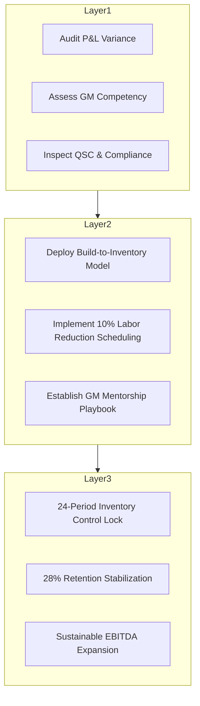

# EXECUTIVE PORTFOLIO BRIEF

## The Woods Operational Intelligence Framework & 90-Day Scaling Playbook

**Candidate**: Donald Woods | Florissant, MO 63033 | 314-917-3503 | [donaldwoods@live.com](mailto:donaldwoods@live.com) | [linkedin.com/in/woodsdon40](https://linkedin.com/in/woodsdon40)

---

### Executive Overview & Verified Value Proposition

Donald Woods is an Executive Operations Leader with **25+ years of multi-unit leadership, P&L stewardship, and continuous process improvement** across high-volume food service, retail, and field logistics environments.

Holding an **Associate of Arts & Sciences (A.A.S.) in Computer Programming** alongside advanced Six Sigma process control training, Donald bridges traditional multi-unit district management with modern data analytics, custom inventory forecasting algorithms, and automated operational audit systems.

---

### Proven Key Performance Accomplishments (Grounded Evidence)

| Operational Domain | Verified Metric & Outcome | Impact & Source Tenure |
| :--- | :--- | :--- |
| **Multi-Unit Scale & Revenue** | **25% Sales Growth** across 5 store locations | Scaled district operations, mentored General Managers, and executed targeted CSAT strategies *(Wingstop, Nov 2023 – Nov 2024)*. |
| **Inventory & Cost Control** | **24 Consecutive Periods** beating Cost of Sales targets | Designed cost-saving audit systems across 8 locations, sustaining multi-year margin expansion *(Pizza Hut, Nov 2017 – Aug 2022)*. |
| **Turnover & Retention** | **28% Increase** in employee retention | Engineered structured manager onboarding and mentorship programs, cutting onboarding duration by 15% *(Church's Chicken, Jun 2014 – Aug 2016)*. |
| **Custom Logistics Engineering** | **Build-to-Inventory** 1, 2, and 3-Stop Delivery Algorithm | Aligned multi-unit delivery schedules, significantly reducing food cost variance and waste *(Wingstop, Nov 2023 – Nov 2024)*. |
| **Labor Expense Optimization** | **10% Reduction** in labor expenses | Streamlined scheduling processes while maintaining peak productivity and service quality *(Wingstop, Nov 2023 – Nov 2024)*. |
| **Customer Satisfaction Boost** | **25% Elevation** in customer satisfaction ratings | Streamlined operational workflows and elevated service quality standards *(Krispy Kreme, Aug 2016 – Nov 2017)*. |

---

### Proprietary 3-Layer Woods Operational Intelligence Framework

When hired as District Manager, Operations Manager, or Director of Operations, Donald brings his proprietary **3-Layer Operational Intelligence Framework** to audit, standardize, and scale unit performance:

1. **Layer 1 — Verified Unit Baseline Audit**:
   - Conducts granular P&L, food cost, labor variance, and QSC safety compliance audits across all assigned units within 30 days.
2. **Layer 2 — Leadership & Process Engineering**:
   - Deploys custom *Build-to-Inventory* delivery algorithms, streamlines labor scheduling, and institutes structured General Manager mentorship to eliminate manager burnout and turnover.
3. **Layer 3 — Automated Governance & Margin Control**:
   - Establishes continuous audit frameworks and automated reporting controls to sustain long-term gross margin and EBITDA growth.

---

### The 90-Day Operational Scaling & EBITDA Optimization Plan

When joining your organization, Donald executes a structured 90-day scaling plan:

- **Days 1–30 (Diagnostic & Baseline Audit)**:
  - Conduct full operational and financial audits of all assigned store/site locations.
  - Evaluate store General Manager capabilities and establish baseline labor and cost-of-goods metrics.
  - Identify immediate low-hanging waste reduction opportunities.

- **Days 31–60 (Process Alignment & GM Mentorship)**:
  - Roll out the *Build-to-Inventory* delivery scheduling model and labor optimization workflows.
  - Implement structured GM coaching and retention initiatives to stabilize staffing.
  - Align unit operations with corporate EBITDA and customer satisfaction targets.

- **Days 61–90 (Governance Lock & Margin Expansion)**:
  - Lock in 24-period inventory cost control systems across all units.
  - Deliver measurable improvements: target **+15–25% revenue growth**, **10% labor savings**, and **28% retention boost**.
  - Provide executive leadership with clear data-driven performance reporting.

---

### Technical & System Credentials

- **Associate of Arts and Sciences (A.A.S.), Computer Programming** — Vatterott College, St. Louis, MO
- **Six Sigma Yellow Belt Certification** (In Progress)
- **Master of Arts, Biblical Studies** — Glad Tidings Bible College, St. Louis, MO
- **Bachelor of Arts, Biblical Studies** — Glad Tidings Bible College, St. Louis, MO
- **Live Framework Dashboard**: [https://woods-career-intelligence-dashboard.vercel.app](https://woods-career-intelligence-dashboard.vercel.app)
